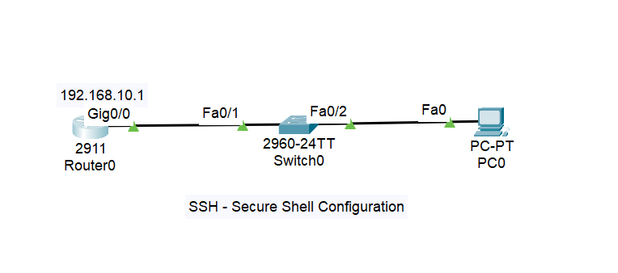

#### SSH - Secure Shell Configuration

1.SSH is used to access router and switch from remote location.
2.SSH is more secure than telnet.
3.SSH port number 22 and telnet port number 23

-------------------------------------------------------------
Router-0:
Router>enable
Router#configure terminal
Enter configuration commands, one per line.  End with CNTL/Z.
Router(config)#interface gig0/0
Router(config-if)#no shutdown
Router(config-if)#ip address 192.168.10.1 255.255.255.0
Router(config-if)#exit

Router(config)#
Router(config)#hostname ccna
ccna(config)#ip domain-name cisco.com
ccna(config)#crypto key generate rsa
The name for the keys will be: ccna.cisco.com
Choose the size of the key modulus in the range of 360 to 4096 for your
General Purpose Keys. Choosing a key modulus greater than 512 may take
a few minutes.

How many bits in the modulus [512]: 1024
% Generating 1024 bit RSA keys, keys will be non-exportable...[OK]

ccna(config)#username ccna password 12345
*Mar 1 0:4:29.214: %SSH-5-ENABLED: SSH 1.99 has been enabled

ccna(config)#line vty 0 4
ccna(config-line)#login local
ccna(config-line)#transport input ssh
ccna(config-line)#
ccna(config)#enable secret 12345
ccna(config)#exit

PC: Remote login through SSH
C:\> ssh -l ccna 192.168.10.1  